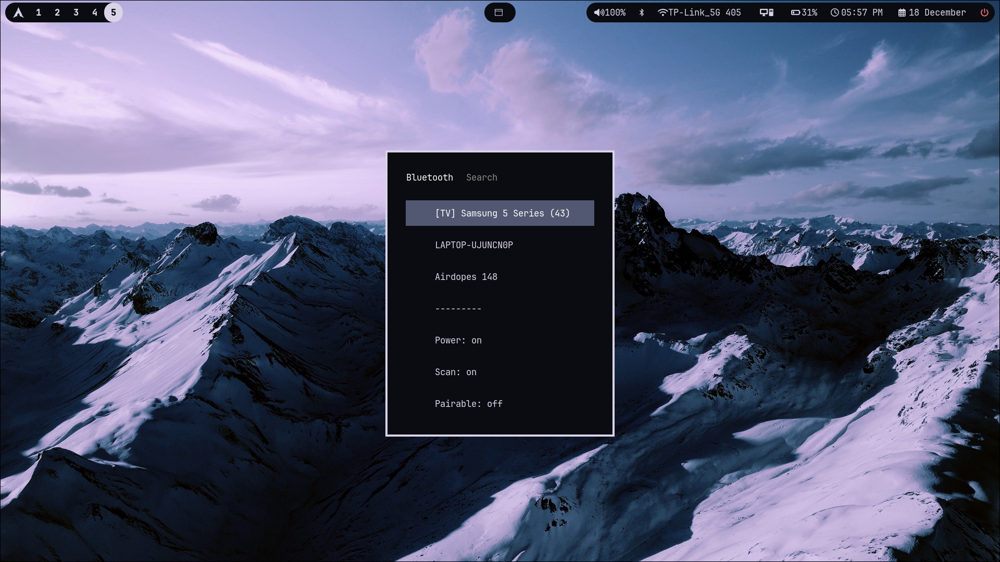
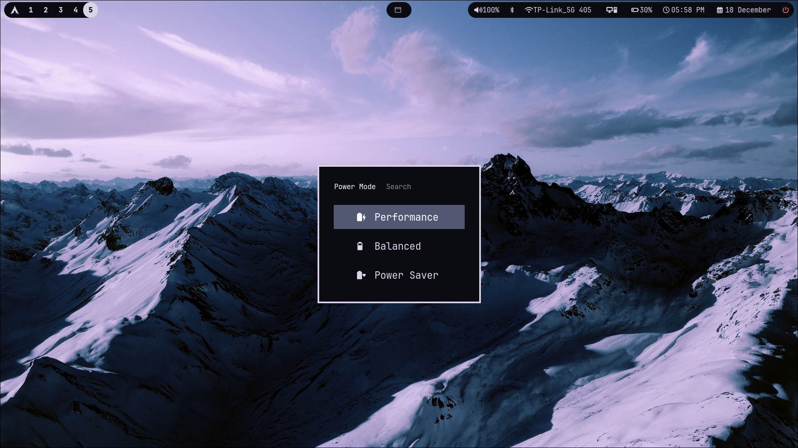
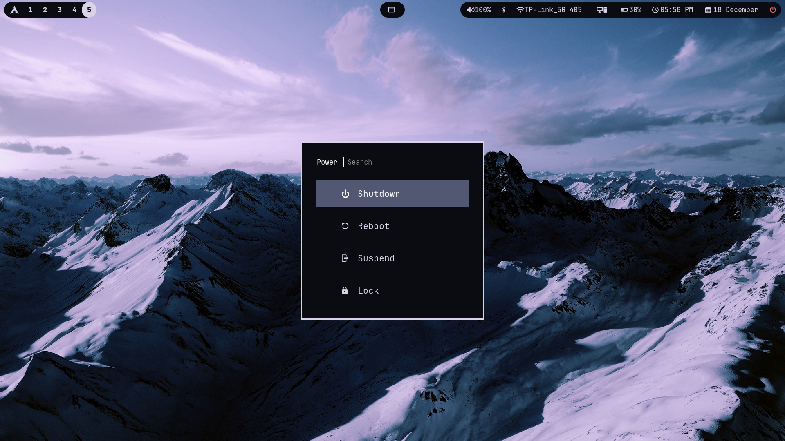

# Minimal Waybar Config
A simple and minimalistic waybar config that has buttons and launchers for each element,
made for Hyprland and Arch Linux. 

# Screenshots
## Bar:

Full View:


## Bluetooth


## Network Manager


## Battery Options


## Power Options


# Installation

## 1] Install packages
Install the required packages through your package manager
```bash
sudo pacman -S waybar rofi networkmanager_dmenu powerprofilesctl nvidia-smi pavucontrol rofi-bluetooth #(For Arch, EndeavourOS, Manjaro, etc)
#OR
sudo apt install waybar rofi networkmanager_dmenu powerprofilesctl nvidia-smi pavucontrol rofi-bluetooth #(For Ubuntu, Debian, etc)
```
Note:
```bash
yay -S rofi-bluetooth rofi-network-manager
```
Install rofi-bluetooth and rofi-network-manager from AUR using yay (For Arch, EndeavourOS, Manjaro, etc),
OR
Install through their GIT repos respectively.

## 2] Copy config
Copy the waybar folder into your ```~/.config/``` folder

## 3] Done !
You can now tweak this minimal config according to your own liking.

~ This was my first rice using Arch and Hyprland, feel free to tweak it and customize :)
